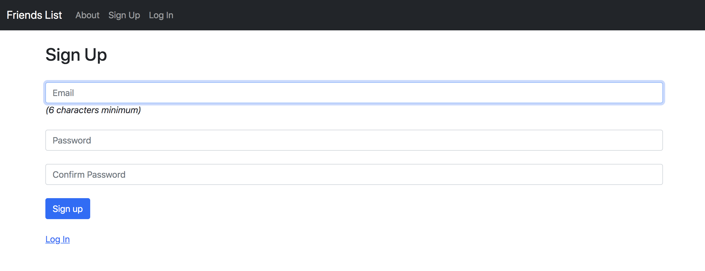

## To run
Clone this git repository:
```sh
git clone https://github.com/jamesbasa/Websites-Based-On-Tutorials.git
```

Change to the Friends List app and install all dependencies:
```sh
cd Friends_List_Website_Rails/Friends/
bundle install
```

Create the db and migrate the schema:
```sh
rake db:create
rake db:migrate
```

Then run the app:
```sh
rails s
```

You can find the server at
http://localhost:3000

## Example



